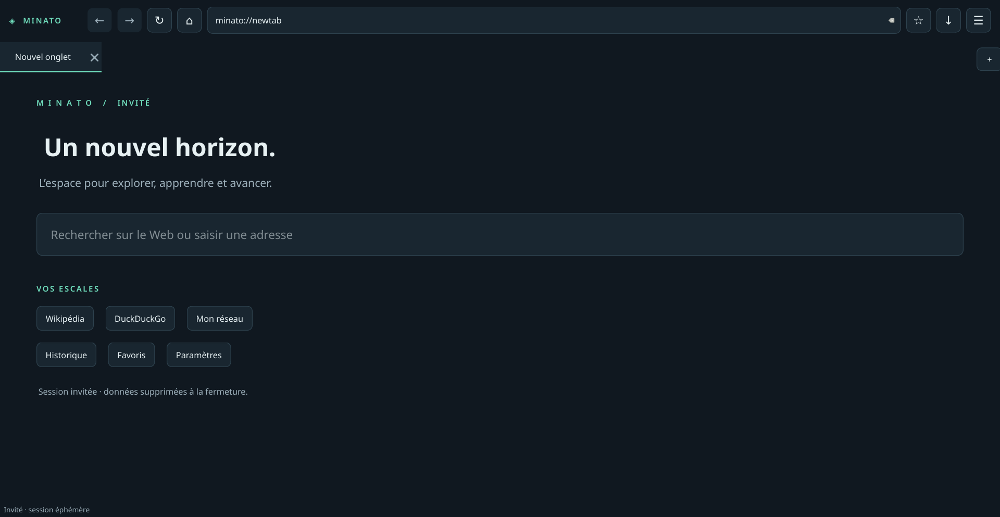

# Minato

**Démonstration distante :** [configuration Vercel + SQLite éphémère](docs/VERCEL-DEMO.md), avec accord du testeur et transmission visible. URL du navigateur dans `src/sync/DemoConfig.h`.


**Mode examen local sans configuration :** [lancer le navigateur et les rapports Django sans connexion](docs/EXAMEN.md).


**Nouveau : [Minato Observatoire, serveur Django de rapports](server/README.md).** Connexion administrateur, API par appareil, recherches/historique de navigation et réseau après activation dans `minato://sync`. Le partage API remplace l’envoi par e-mail dans l’interface.


Minato est un navigateur desktop C++17 / Qt 6 Widgets, basé sur **Qt WebEngine**. Son interface « Nuit · menthe » réunit une barre de navigation compacte et un espace de travail à onglets. Un thème clair est également disponible.

Cette version se concentre sur la **V1 utilisable**. Le coffre-fort de mots de passe et les fonctions avancées décrites dans la feuille de route ne sont pas présentés comme déjà implémentés.

## Fonctionnalités V1

- Navigation HTTP/HTTPS, recherche DuckDuckGo/Google/Bing, précédent/suivant, actualiser/arrêter, titres, favicons, zoom.
- Onglets indépendants partageant le profil WebEngine ; nouveaux onglets, fermeture, duplication, restauration à la fermeture normale (30 onglets maximum au prochain lancement).
- Fenêtres demandées par une action utilisateur ouvertes en onglets ; fenêtres automatiques bloquées.
- Profil persistant : cookies persistants **et cookies de session**, cache disque et stockage Web. Les sites restent libres d’expirer une session ou de demander une nouvelle authentification.
- Profils isolés via `--profile Personnel` / `--profile Travail` ; mode invité avec `--private`.
- Historique SQLite : recherche, compte de visites, suppression multiple, effacement ; favoris : ajout, recherche, modification, suppression.
- Informations réseau locales : interfaces, état, IPv4, IPv6, MAC lorsqu’exposée, type fourni par Qt.
- Partage API facultatif avec un parc administré : nouvelles recherches, visites et réseau ; rapports Django avec connexion administrateur. Voir [le guide serveur](server/README.md).
- IP publique facultative : requête HTTPS asynchrone vers ipify sur clic explicite, avec délai maximal de 10 secondes.
- Téléchargements : choix du fichier, progression, annulation, erreurs, ouverture du dossier ; suivi limité à la session.
- Paramètres par profil : moteur, accueil, restauration, historique, dossier de téléchargement, apparence, effacement des cookies/cache.

## Pages internes

| Adresse | Contenu |
| --- | --- |
| `minato://newtab` | Accueil, recherche et favoris rapides |
| `minato://network` | Interfaces locales et consultation facultative de l’IP publique |
| `minato://history` | Historique recherchable |
| `minato://bookmarks` | Favoris |
| `minato://settings` | Préférences du profil |
| `minato://sync` | Association au serveur et activation/arrêt du partage |
| `minato://downloads` | Accès au suivi de la session |
| `minato://about` | Version et informations |
| `minato://passwords` | État explicite : coffre-fort non activé dans cette V1 |

Ces adresses sont routées vers des **widgets natifs**. Elles ne sont pas chargées comme des sites Internet et n’exposent aucun QWebChannel. Les navigations vers `minato://` provenant d’un site distant sont refusées.

## Prérequis

- CMake ≥ 3.21, compilateur C++17, Qt ≥ 6.4 avec Widgets, WebEngineWidgets, Network, SQL ; Qt Test pour les tests.
- Pilote SQLite Qt installé ; environnement graphique utilisable et dépendances graphiques de Qt WebEngine.
- Linux : GCC ou Clang. Windows 10/11 x64 : kit **MSVC** compatible avec la version Qt choisie. Ne pas choisir MinGW pour cette configuration WebEngine.
- Utiliser une version Qt maintenue : les mises à jour de Chromium/WebEngine sont essentielles pour un navigateur.

## Fedora

```bash
sudo dnf install gcc-c++ cmake ninja-build qt6-qtbase-devel qt6-qtwebengine-devel qt6-qtbase-sqlite
# Pour les tests graphiques sans écran :
sudo dnf install xorg-x11-server-Xvfb
cmake -S . -B build -G Ninja -DCMAKE_BUILD_TYPE=Release
cmake --build build --parallel 2
./build/minato
```

## Ubuntu 24.04 et versions compatibles

```bash
sudo apt update
sudo apt install build-essential cmake ninja-build qt6-base-dev qt6-webengine-dev libqt6sql6-sqlite xvfb xauth
cmake -S . -B build -G Ninja -DCMAKE_BUILD_TYPE=Release
cmake --build build --parallel 2
./build/minato
```

Si plusieurs versions Qt sont installées, ajouter `-DCMAKE_PREFIX_PATH=/chemin/vers/Qt/6.x/gcc_64`. Pour compiler sans les tests : `-DBUILD_TESTING=OFF`.

## Windows 10/11 : compilation simplifiée

**Sur votre PC Windows :** installer une fois Visual Studio 2022 / Build Tools (charge **Desktop development with C++**, SDK Windows), CMake et Qt 6 MSVC 2022 x64 avec Qt WebEngine. Puis double-cliquer sur **`build-windows.cmd`**. Le script détecte Visual Studio et les kits dans `C:\Qt`, compile en Release, exécute les tests unitaires et crée une distribution complète dans `dist/windows/<date-identifiant>/`.

Pour choisir un kit Qt ou produire aussi un installateur :

```powershell
.\build-windows.cmd -QtRoot "D:\Qt\6.11.2\msvc2022_64"
# NSIS installé une fois pour produire le setup.exe :
.\build-windows.cmd -Installer
```

Aucune invite « Developer Command Prompt » n’est nécessaire. Les utilisateurs recevant le paquet n’ont pas besoin d’installer Qt ni Visual Studio. Voir [le guide Windows](docs/WINDOWS.md) pour les prérequis, les limites de validation et les options.

## Profils et données

```bash
./build/minato --profile Personnel
./build/minato --profile Travail
./build/minato --private
```

Les identifiants de profil acceptent lettres ASCII, chiffres, tirets et soulignés (40 caractères maximum). Un verrou empêche deux instances d’utiliser simultanément le même profil.

Les chemins passent par `QStandardPaths` : typiquement `$XDG_DATA_HOME/Minato/Minato/profiles/<profil>` (ou `~/.local/share/...`) sous Linux et `%LOCALAPPDATA%/Minato/Minato/profiles/<profil>` sous Windows. Le cache utilise `CacheLocation`. Chaque dossier contient `settings.ini`, `minato.sqlite` et `web/`.

Le mode invité utilise SQLite en mémoire, un profil WebEngine *off the record*, et un dossier temporaire supprimé à la fermeture normale. Les fichiers explicitement téléchargés restent sur disque. Les données du système (swap, journaux du système ou du réseau) ne sont pas sous le contrôle de Minato.

## Raccourcis

| Action | Raccourci |
| --- | --- |
| Nouvel onglet / fermer | Ctrl+T / Ctrl+W |
| Onglet suivant / précédent | Ctrl+Tab / Ctrl+Maj+Tab |
| Adresse / favori | Ctrl+L / Ctrl+D |
| Actualiser / arrêter | Ctrl+R ou F5 / Échap |
| Précédent / suivant / accueil | Alt+Gauche / Alt+Droite / Alt+Début |
| Historique / téléchargements | Ctrl+H / Ctrl+J |
| Zoom / réinitialiser | Ctrl++ / Ctrl+- / Ctrl+0 |

## Architecture

```text
src/
  main.cpp                 initialisation, arguments, verrou du profil
  browser/                 résolution URL, page Web sécurisée, état d’onglet
  profiles/                cycle de vie du profil, préférences, stockage
  database/                SQLite, requêtes préparées, schéma versionné
  network/                 interfaces et fournisseur d’IP publique
  downloads/               téléchargement Qt et suivi de session
  sync/                    client API, file en mémoire et autorisation native
  reports/                 ancien module SMTP (non accessible dans l’interface)
  ui/                      fenêtre, composants et pages internes natives
server/                    Django : connexion, rapports, appareils, API, migrations
resources/                 identité visuelle et ressources Qt
packaging/                 entrée desktop Linux
tests/                     tests unitaires et tests WebEngine sur serveur local
docs/                      sécurité, vérification et feuille de route
```

`Store` centralise les requêtes SQL ; aucune requête SQL n’est écrite dans l’interface. `PRAGMA user_version` versionne le schéma. `Profile` possède les services partagés et survit aux pages Web. Les objets Qt possédés utilisent le parentage ; les services non widgets utilisent RAII.

## Tests

```bash
ctest --test-dir build -R core --output-on-failure
# Depuis une session graphique :
ctest --test-dir build --output-on-failure
# Ou sous Linux sans écran :
xvfb-run -a ctest --test-dir build --output-on-failure
```

Les tests WebEngine utilisent un serveur HTTP local, sans dépendre d’un site public. Ne pas désactiver le sandbox Chromium pour faire fonctionner les tests. Exécuter comme utilisateur normal, avec un environnement autorisant les mécanismes de sandbox du système.

Pour enregistrer les captures du test graphique : `mkdir -p /tmp/minato-captures`, puis `MINATO_SCREENSHOT_DIR=/tmp/minato-captures xvfb-run -a ./build/browser_tests`.

## Distribution

### Windows

Utiliser `build-windows.cmd` pour le ZIP, ou `build-windows.cmd -Installer` pour ajouter un installateur NSIS. La compilation se fait localement ; l’ancienne configuration GitHub Actions est archivée et désactivée.

Le script rassemble les dépendances avec le déploiement Qt, ajoute le runtime MSVC local, contrôle les DLL/plugins/ressources WebEngine, puis teste le lancement sans Qt dans `PATH`. Chaque exécution utilise un nouveau dossier de distribution. Le ZIP doit être extrait entièrement ; ouvrir ensuite `bin/minato.exe`. L’installateur ajoute un raccourci au menu Démarrer et une désinstallation.

La vérification de lancement `--version` ne remplace pas un essai de navigation sur une machine Windows propre. Les builds ne sont pas signés numériquement.

### Linux

```bash
cmake --install build --prefix dist/usr
```

Cette installation contient l’exécutable et l’entrée desktop. Elle **ne produit pas un bundle autonome Qt**. Pour un paquet Fedora/Ubuntu, déclarer les dépendances d’exécution Qt WebEngine, Widgets, Network, SQL/SQLite et les plugins graphiques de la distribution. Tester `QtWebEngineProcess`, ses ressources et les locales sur une machine cible. Un binaire Fedora n’est pas garanti portable sur Ubuntu ; compiler/packager sur chaque famille cible. Un AppImage/Flatpak nécessitera une recette et une validation complémentaires.

`cpack --config build/CPackConfig.cmake` crée une archive des fichiers installés ; sous Linux elle suppose les dépendances Qt système. Fournir les mentions de licences Qt/Chromium et les obligations applicables avant distribution publique.

Références officielles : [déploiement WebEngine](https://doc.qt.io/qt-6/qtwebengine-deploying.html), [Qt pour Windows](https://doc.qt.io/qt-6/windows.html), [persistance des profils](https://doc.qt.io/qt-6/qwebengineprofile.html).

## Sécurité et limites

Voir [le modèle de sécurité](docs/SECURITY.md) et [la feuille de route](docs/ROADMAP.md).

- Aucun gestionnaire de mots de passe actif : aucune capture, aucun mot de passe stocké en clair ou dans SQLite.
- Les sessions des sites restent sensibles. Les fichiers de profil ne constituent pas un coffre-fort chiffré.
- Les certificats invalides sont refusés ; pas de bouton de contournement.
- La MAC n’est jamais envoyée par le module réseau ; les sites utilisent néanmoins normalement votre connexion Internet et les API Web de Chromium.
- L’effacement des cookies/cache ne supprime pas encore l’ensemble des données de sites (IndexedDB, localStorage, Service Workers).
- Pas encore de gestion graphique des profils, dossiers de favoris, historique persistant des téléchargements, extensions, permissions avancées (caméra/micro), synchronisation ni mise à jour automatique.
- La restauration conserve les adresses, pas les formulaires ni la pile précédent/suivant de chaque onglet ; les fermetures brutales ne sont pas garanties.
- DRM, codecs propriétaires, certains flux OAuth et politiques de sites tiers peuvent limiter la compatibilité ; aucun contournement d’identité n’est ajouté.

## Captures



Capture réelle issue du test graphique Fedora. Des captures Windows et du thème clair pourront être ajoutées ultérieurement. Voir [le rapport de validation](docs/VALIDATION.md).
